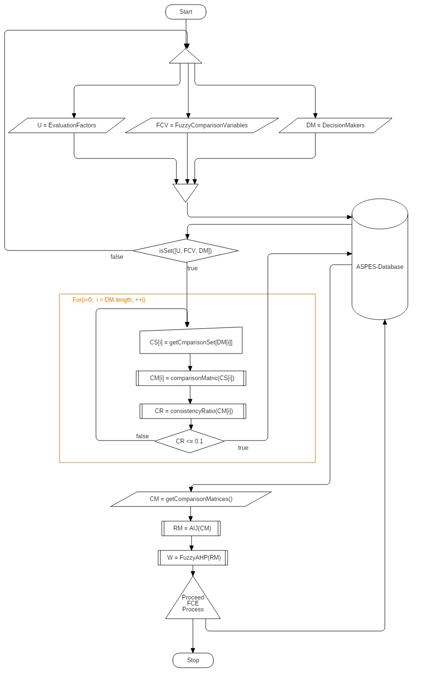
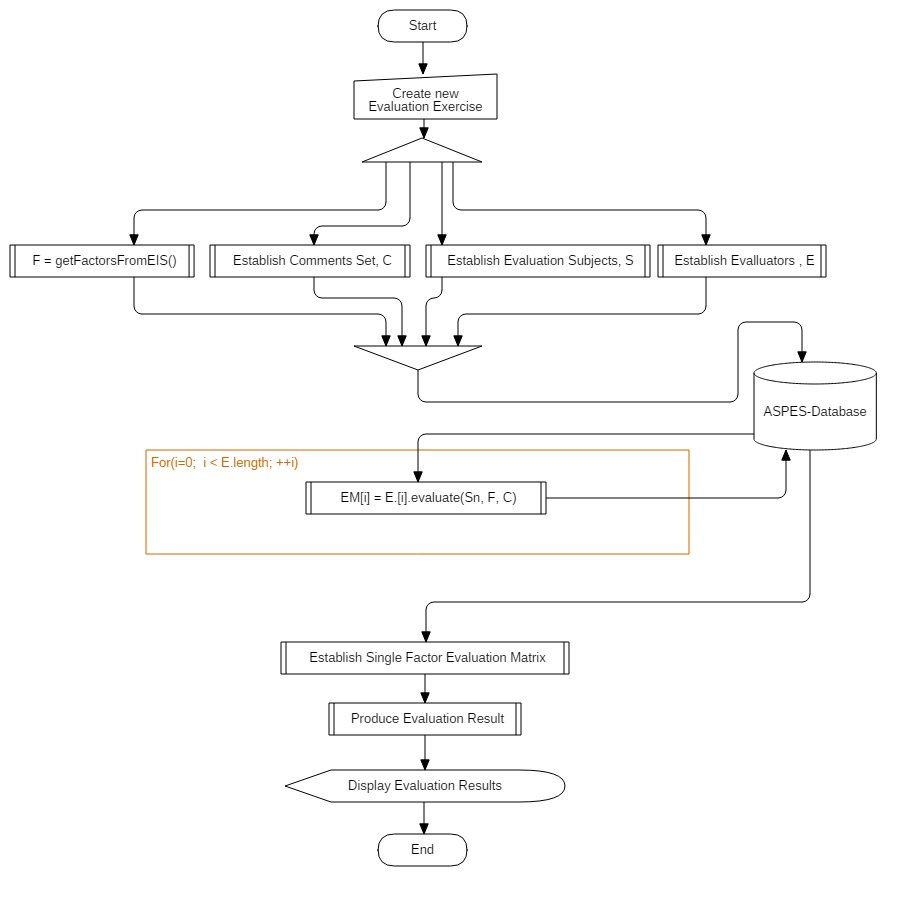
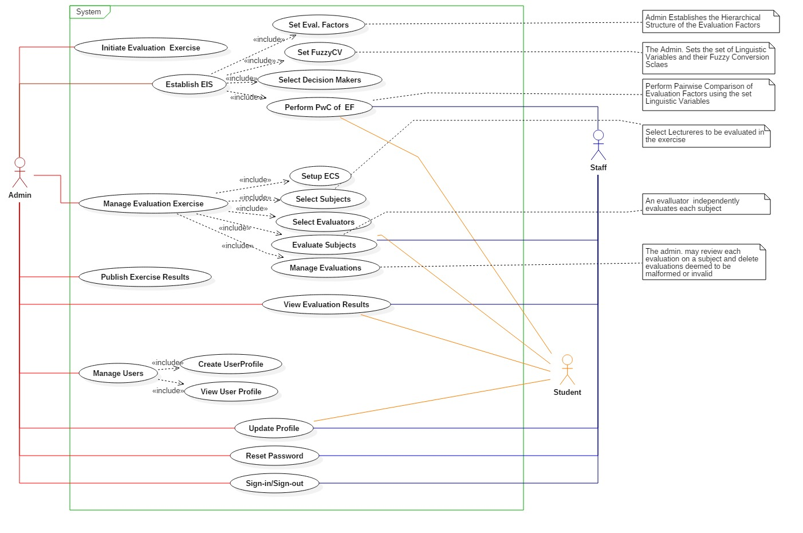
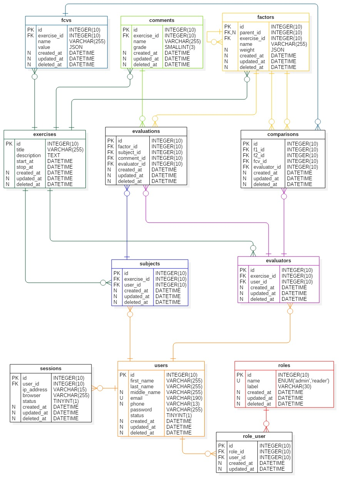

<h1>ASPES</h1>
<h4>Academic Staff Performance Evaluation System for Universities.</h4>

An application of Fuzzy Analytic Hierarchy Process (FAHP) and Fuzzy Comprehensive Evaluation Approach.

<h3>Analysis and System Design</h3>

The proposed system is an automated system where individual subjective opinions of evaluators (students and staff) 
are collected through an inexpensive electronic questionnaire, validated, aggregated and scientifically 
converted to a representative, objective result reflective of reality.

The scientific process here involves the application of Fuzzy Analytic Hierarchy Process (Fuzzy AHP) 
and Fuzzy Comprehensive Evaluation Approach.

<h4>The Fuzzy Analytic Hierarchy Process (Fuzzy AHP)</h4>

The AHP decision making process uses pairwise comparison and matrix algebra to identify and estimate 
the relative importance of elements. This method questions relevant stakeholders using a nine-point 
scale. AHP has the power to solve complex decision making problems. However, ambiguous problems can 
limit the power of the pure AHP. Fuzzy AHP, an extension of the AHP model, has been applied to fuzzy 
decision making problems. In Fuzzy AHP, by using Fuzzy arithmetic, the weights of evaluation elements 
are determined.

The steps for application of fuzzy AHP in this system is illustrated in the flowchart diagram below:

<h4>Fuzzy Comprehensive Evaluation Approach</h4>

Fuzzy Comprehensive Evaluation is an application of fuzzy mathematics. It uses the principles of fuzzy 
transformation and maximum membership degree, evaluating all relevant factors to make a comprehensive 
evaluation. This is an efficient evaluation method to evaluate objects that are influenced by various 
factors. For objects that are influenced by a few factors, we can use one-layer models. If the objects 
are complicated and the number of factors is large, we can use models with two or more layers. In this 
system, a fuzzy comprehensive evaluation model with two layers was used as a tool for academic staff 
performance evaluation.

The steps for application of Fuzzy Comprehensive Evaluation Approach in this system are show the flowchart 
diagram below:

<h4>Use Case Analysis for the Proposed System (Diagram)</h4>

The use case diagram of the proposed system shows the different user roles (actors) and their various
interactions (designated as use cases) with the system. A use case is a series of one or more activities,
operations or functions which an actor of the proposed ASPES System will have to perform within 
its designated class or sub-system. The figure below presents a use case diagram of the proposed system: 

<h4>Database Design for the Proposed System (ER-Diagram)</h4>

The entity-relationship diagram below shows the different data entities involved in the operations of ASPES 
and their relationships with each other. The cardinality of relationships are designated using crow-foot notation.

<a href="../database/aspes.sql">SQL-Implementation</a> also available here.

<h5 style="text-align:center"><a href="../README.md">&lt; Back</a></h5>
